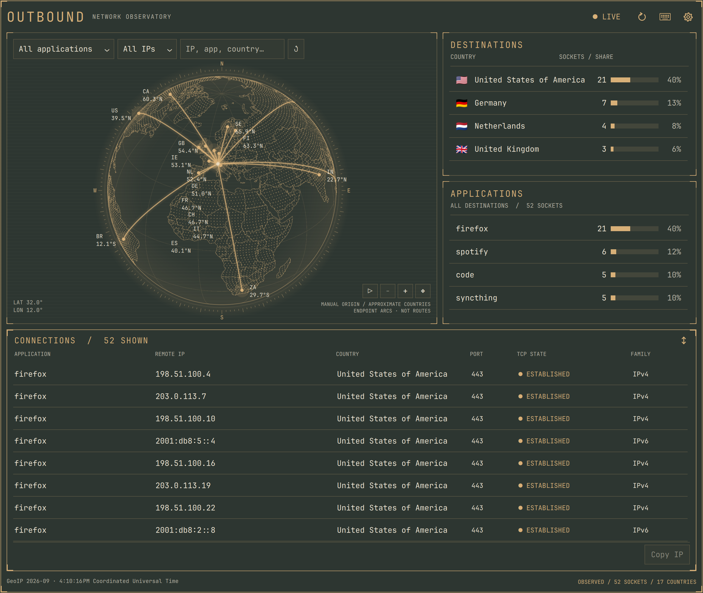
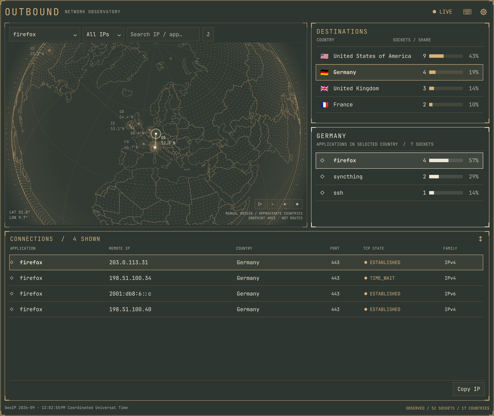
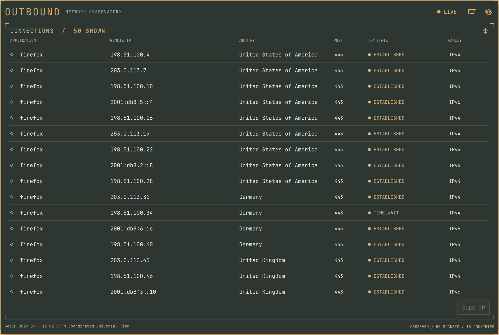

# Outbound

See where your apps connect.

Outbound is an Omarchy plugin that displays observed Linux TCP connections by
application, remote IP and country, with an interactive globe. The interface
uses QML/Quickshell; the collector is Ruby compiled to a native executable with
Spinel. Only real connections are displayed.



## Features

- Bar counter, compact panel and expanded window sharing the same view state.
- Application, country and IP-family filters, text search and IP copying.
- Rotatable globe with 1×–4× zoom, country markers and connection arcs.
- Local GeoIP lookup, with an optional database download started by the user.
- Origin selection by city search or manual coordinates.
- Keyboard controls and Omarchy theme colors.

| Country and application filters | Connection list expanded |
| --- | --- |
|  |  |

Screenshots use the fictional collector in `demo/fixtures/`, with addresses from
documentation ranges; the plugin itself has no demo mode.

## Requirements

- Linux x86_64 or ARM64 with glibc 2.35 or newer.
- The Omarchy Quattro built-in bar with Quickshell.
- Python 3.11+ for collector and GeoIP installation and city search.

Ruby and Spinel are build tools, not runtime requirements. The current Ruby
collector and isolated Quickshell integration have been tested on Linux ARM64.
Release binaries are built and checked natively on x86_64 and ARM64 in CI, but
the x86_64 desktop integration and physical multi-monitor behavior remain
unverified.

## Install

```bash
omarchy plugin add https://github.com/simoz/omarchy-outbound.git --enable
```

Open Outbound and click **Install collector** on the globe. Outbound downloads
the prebuilt collector for its version and architecture from the GitHub release,
checks it against the SHA-256 pinned in `tools/engine-release.json` and installs
it under `${XDG_DATA_HOME:-$HOME/.local/share}/outbound/`. Nothing is downloaded
before that click. Then use **Install GeoIP** to show destination countries.
See [collector installation](docs/development.md#install-the-plugin) for
details and building from source.

## Uninstall

```bash
omarchy plugin remove io.github.simoz.outbound
rm -rf "${XDG_DATA_HOME:-$HOME/.local/share}/outbound"
```

The first command disables the plugin and deletes its folder. The second
removes the installed collector and GeoIP database; skip it to keep them for a
later reinstall.

## Build and run from source

Prepare the pinned Spinel compiler and static libmaxminddb as described in the
[development guide](docs/development.md#build-the-rubyspinel-collector), then run:

```bash
./run-ui.sh
```

The launcher builds the collector when needed and opens an isolated live
preview without installing or changing the desktop bar. To use an existing
country database:

```bash
OUTBOUND_DATABASE=/absolute/path/to/country.mmdb ./run-ui.sh
```

The default installed collector path is
`${XDG_DATA_HOME:-$HOME/.local/share}/outbound/bin/outbound-engine`.

## Using Outbound

Left-click the bar widget to toggle the compact panel. Right-click it to open
the expanded window directly, or bring it into focus if it is already open.

Collection starts when a panel or window opens. Closing the last open view
stops the collector and clears the connection snapshot from memory. The bar
alone does not collect data. Its globe icon is dimmed with no counters while
closed or paused; during collection it lights up and shows socket/country counts
once a snapshot is available.

Use **LIVE / PAUSED** in the header to pause or resume collection. The button
shows **ERROR** if collection fails; details and retry are in Settings → Collection.
Manual pause survives closing and reopening the view.
Use **Refresh** (⟳) beside it to request an immediate snapshot. While paused,
Refresh collects once and stays paused. Filters and globe position are preserved.
Refresh is unavailable while a refresh or a collector/GeoIP installation is in progress.

Open settings with the gear button:

- **Collection**: refresh interval, pause/resume, retry, coverage details,
  prebuilt collector installation and backend executable path.
- **Globe**: install/update GeoIP, choose a custom MMDB and set the origin.
- **Credits**: data sources, attribution and licenses.

**Done** saves paths, refresh interval and manual origin coordinates, then closes
the editor. Invalid values or a save failure keep it open. **Esc** or clicking
outside closes without saving those edits. To search for an origin, type a city
and press **Enter** or **Search**, then choose a result; this saves the origin
immediately. Glow and scanlines are enabled.

The arrow button in the main header switches between compact panel and expanded
window, preserving filters, selection and globe position.

Filter by application, country and IP family, or type an IP/application name in
Search. Select the same country or application again to clear that filter; **↺**
clears all filters. Select a connection, then use **Copy IP** to copy its remote
address.

The arrow button in the connection list header expands the list to the full
height, hiding the globe and facets; press it again to restore them.

Use Play/Pause inside the globe to toggle rotation independently of collection.
Drag the globe to rotate it. Use the wheel, touchpad scrolling or **+/−** to
zoom. With the globe focused, arrow keys rotate, **+/−** zoom and **Home** resets
the view. **=** also zooms in.

### Keyboard controls

The keyboard button or **F1** opens the KEYS guide. F1 is inactive while Settings
is open. Buttons, including Refresh, use **Tab** to focus and **Enter** or
**Space** to activate.

| Focus / context | Keys | Action |
| --- | --- | --- |
| Controls | Tab / Shift+Tab | Move to the next / previous control |
| Button or list row | Enter / Space | Activate the button, toggle a filter or select a connection |
| Country, application or connection list | ↑ / ↓ | Move between rows |
| Dropdown | Space, then ↑ / ↓ and Enter | Open, choose and confirm |
| Globe | ← / ↑ / → / ↓ | Rotate |
| Globe | + or = / − | Zoom in / out |
| Globe | Home | Reset orientation and zoom |
| Origin city field | Enter | Search for the typed city |
| KEYS guide | ↑ / ↓ / PgUp / PgDn | Scroll the guide |
| Dashboard / KEYS guide | F1 | Open / close the guide |
| Dropdown, Settings or guide | Esc | Close that popup |
| Dashboard | Esc | Close Outbound |

To pause collection, refresh once, switch panel/window, expand the connection
list, clear filters or copy an IP, focus the corresponding button and activate
it. Globe controls apply only while the globe is focused; typing in a text field
keeps its normal editing behavior.

If geolocation is missing, use **Install GeoIP**. Downloads never start
automatically. Without an origin, the globe shows destination countries without
arcs. See [GeoIP installation and updates](docs/geoip.md).

## What the data means

Connections are sampled; short-lived sockets may be missed. **PARTIAL** means
some socket or ownership information is unavailable, restricted or omitted by
resource limits. Settings → Collection shows the coverage counters.

GeoIP locations are approximate. Arcs connect the configured origin to country
markers; they are not packet routes. Connection direction is unknown. Shared
sockets may belong to several applications. The collector does not capture
payloads, infer destinations behind proxies or VPNs, or store connection history.

## Development and licenses

Build scripts, automated tests and local diagnostic tools remain in this
repository. Retired backends and feasibility experiments are available in Git
history.

- [Development, installation and tests](docs/development.md)
- [Architecture](docs/architecture.md)
- [Ruby source guide](backend/ruby/README.md)
- [Collector protocol](docs/protocol.md)
- [GeoIP data and updates](docs/geoip.md)
- [Map attribution](assets/NOTICE.md)
- [Native dependency notices](backend/DEPENDENCIES.md)

Outbound code is [MIT](LICENSE). Natural Earth geometry is public domain.
The prebuilt collector includes the Spinel runtime (MIT) and libmaxminddb
(Apache-2.0); their notices are installed beside it.
Managed DB-IP Lite data is separately licensed under CC BY 4.0; provider and
license links are available in Credits and accompany each installed database.
